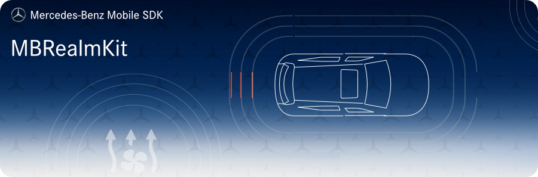

[](https://developer.apple.com/swift/)
[](https://developer.apple.com/swift/)
[](https://developer.apple.com/swift/)


## Requirements

- Xcode 10.3 / 11.x
- Swift 5.0 / 5.1 / 5.2
- iOS 10.0+

## Installation

MBRealmKit is available through [CocoaPods](http://cocoapods.org). To install it, simply add the following line to your Podfile:

```ruby
pod "MBRealmKit"
```

## Intended Usage

This module handles the offline storage of the MBSDK-Modules. It caches the required data and returns it. It is possible to observe the cached data and to respond to the changes.

## Author

Daimler AG, developer@daimler.com

## License

MBRealmKit is available under the MIT license. See the LICENSE file for more info.
